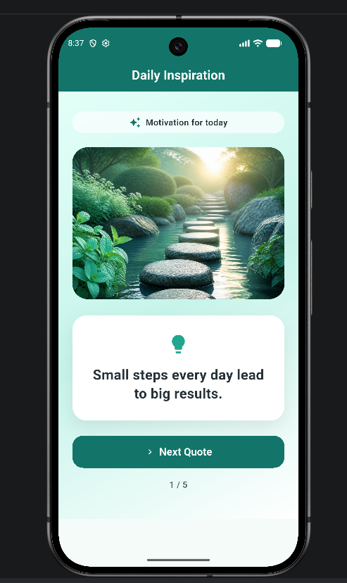
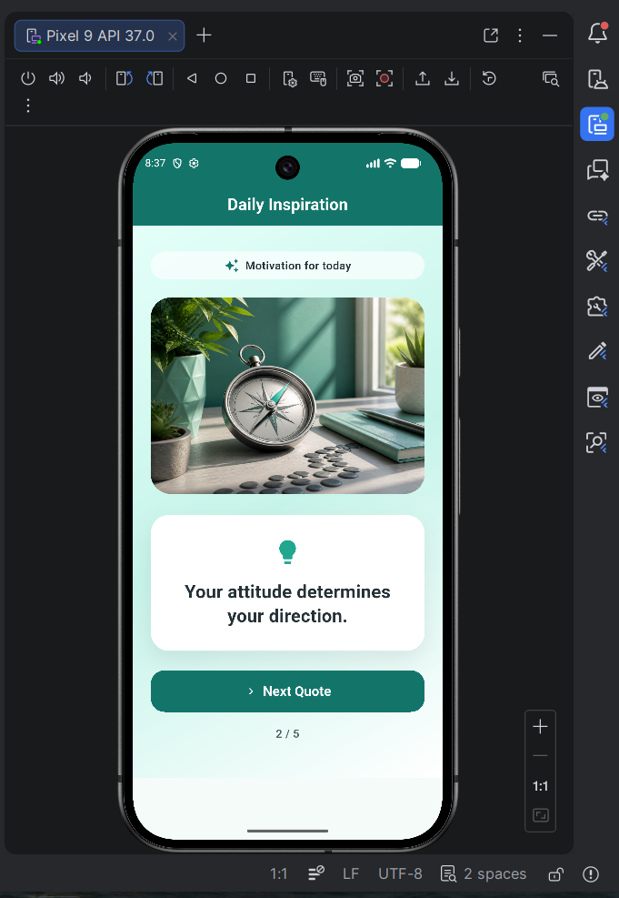
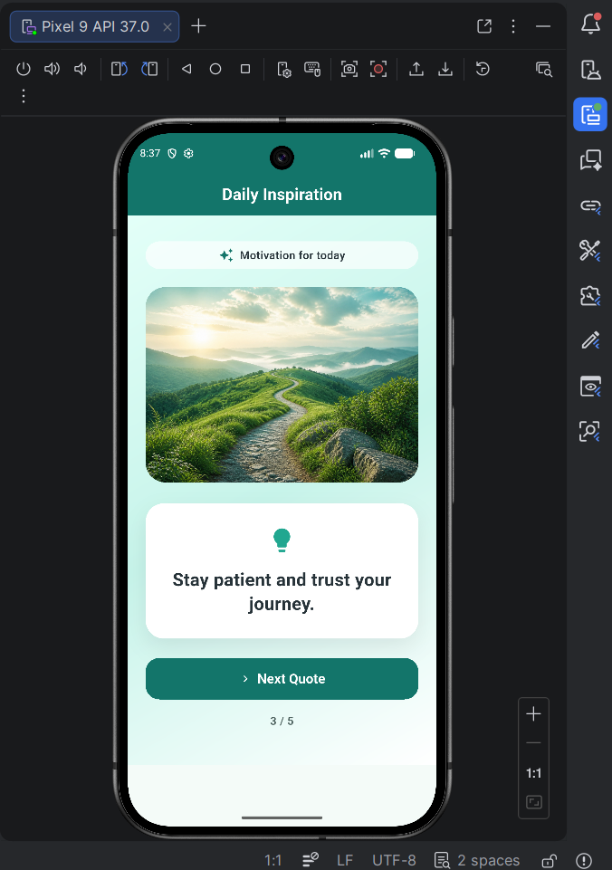
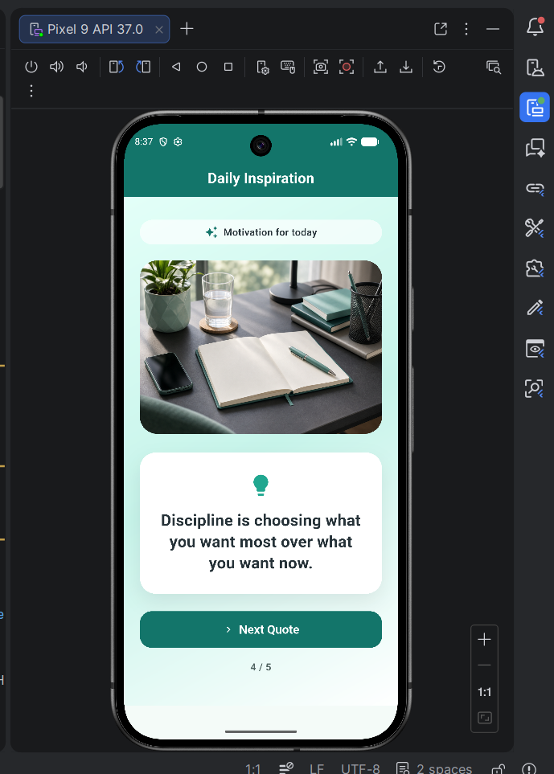
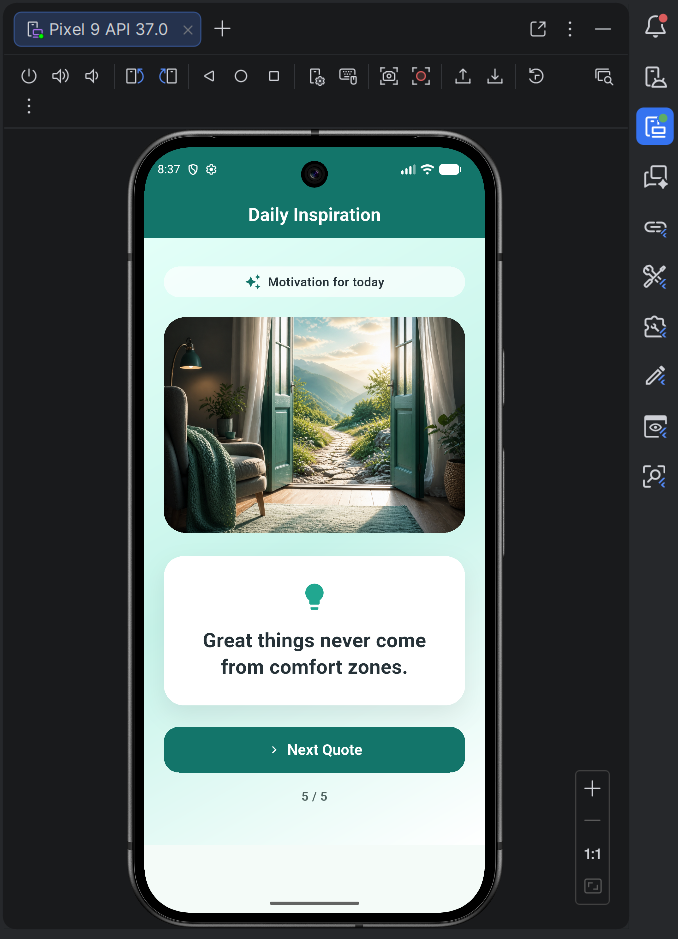

# Quote App 

A simple Flutter mobile app that displays daily inspirational quotes with matching images. Tap **Next Quote** to cycle through five motivational messages.

## Features

- Material 3 UI with a teal gradient theme
- Five inspirational quotes, each paired with a unique image
- Quote counter showing current position (e.g. 1 / 5)
- Runs on Android, Web, and Windows

## Screenshots

| Quote 1 | Quote 2 |
| --- | --- |
|  |  |

| Quote 3 | Quote 4 |
| --- | --- |
|  |  |

| Quote 5 |
| --- |
|  |

## Getting Started

### Prerequisites

- [Flutter SDK](https://docs.flutter.dev/get-started/install) (Dart 3.0+)
- Android Studio or VS Code with the Flutter extension
- An Android emulator, physical device, or supported desktop/browser target

### Run the app

```bash
flutter pub get
flutter run
```

To target a specific device:

```bash
flutter run -d emulator-5554   # Android emulator
flutter run -d windows         # Windows desktop
flutter run -d chrome          # Chrome browser
```

## Project Structure

```
lib/main.dart          # App entry point and UI
assets/images/         # Quote background images
docs/screenshots/      # App screenshots for documentation
```

## Resources

- [Flutter documentation](https://docs.flutter.dev/)
- [Write your first Flutter app](https://docs.flutter.dev/get-started/codelab)
